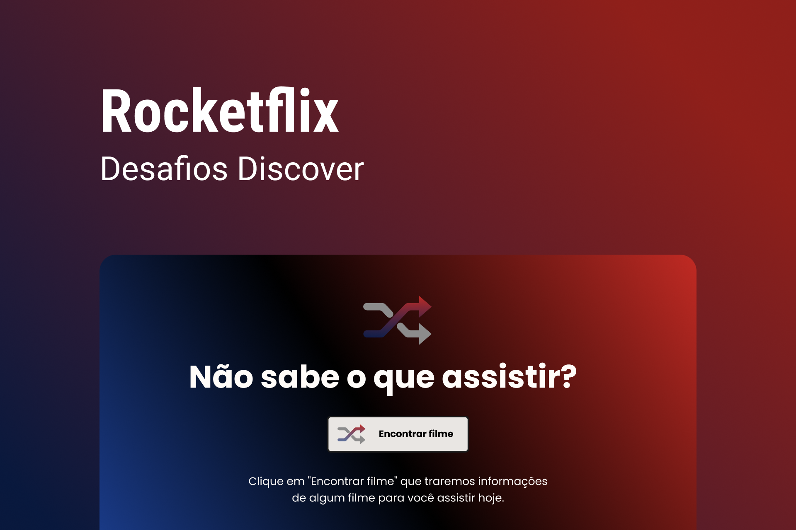

<h1 align="center">
  Rocketflix
</h1>

  
  
  

<h1 align="center">
  
</h1>

## 💻 Projeto

O projeto é um app que exibe um filme aleatório para quem procura um filminho, mas não sabe o que assistir.

## 🧪 Tecnologias

Esse projeto foi desenvolvido com as seguintes tecnologias

- HTML
- CSS
- JavaScript

## 🚀 Como executar

- Clone o repositório
- Coloque a sua chave de api do The Movie Database no arquivo `api.js`, para fazer isso, segue esse [link de instrução do Notion](https://efficient-sloth-d85.notion.site/Desafio-Rocketflix-5ca1c56b5e52473eb12e8b2bc3ab1b8d#06e6ecb4212447c695dfbe7da61ec551)
- Em seguida, abre o `index.html` do projeto, que abrirá no seu navegador

---

Feito com 💜 by Pedro Duarte 👋🏻
